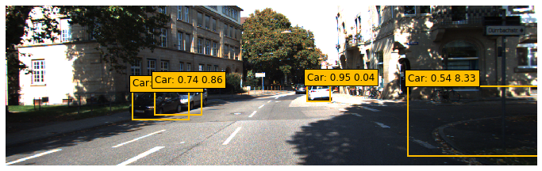
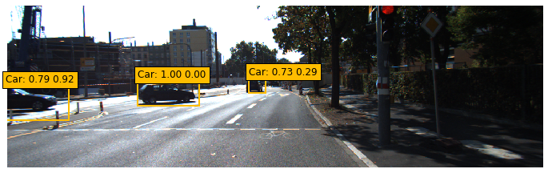
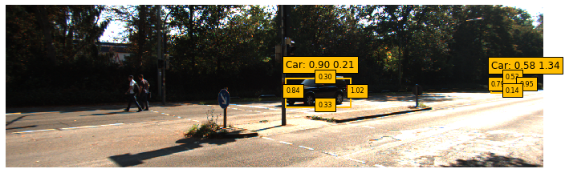

# Laplace Approximation for Real-time Uncertainty Estimation in Object Detection



ITSC 2022

**PyTorch Implementation of Laplace Approximation for Real-time Uncertainty Estimation in Object Detection**

[Ming Gui](https://github.com/mgui7), [Tianming Qiu](https://github.com/TianmingQiu), Fridolin Bauer, [Hao Shen](https://www.fortiss.org/forschung/projekte/detail/machine-learning-lab)
<br />  
## Requirements
Clone repository and install the corresponding python dependencies using PIP
```sh
git clone https://github.com/mgui7/diagonal-LA-for-object-detection
cd diagonal-LA-for-object-detection
pip install -r requirements.txt
```

## Data preparation
This repository runs on the [Kitti](http://www.cvlibs.net/datasets/kitti/) dataset. To download the dataset, locate to the root of this repository and run

```sh
mkdir data/kitti
cd data/kitti
wget https://s3.eu-central-1.amazonaws.com/avg-kitti/data_object_image_2.zip
unzip data_object_image_2.zip
wget https://s3.eu-central-1.amazonaws.com/avg-kitti/data_object_label_2.zip
unzip data_object_label_2.zip
```

It should have the following structure:
```
$ .../data/kitti
├── testing
│   ├── image2
│   │   ├── 000000.png
│   │   ├── ...
├── training
│   ├── image2
│   │   ├── 000000.png
│   │   ├── ...
│   ├── label2
│   │   ├── 000000.txt
│   │   ├── ...
```

## Training and running the model
The underlying object detection algorithm of this repository is [SSD](https://arxiv.org/abs/1512.02325). We need to first train the SSD by `python train_deterministic.py`. The corresponding settings files is located at `data/config.py`.

After that, run `python train_bnn.py` to train the BNN using diagonal Laplace approximation. 

Run `python test_bnn.py --images N` to evaluate `N` images on the trained BNN. The first label indicates the softmax score provided by the SSD, while the second score is the uncertainty produced by the BNN.



For boundary uncertianties, run `python test_bnn.py --images N --boundary True`


